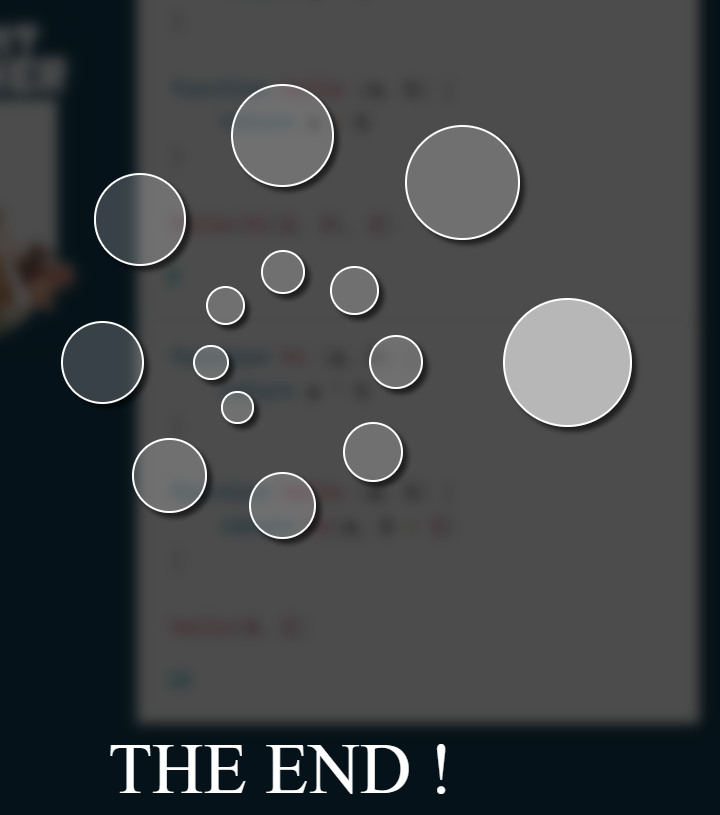
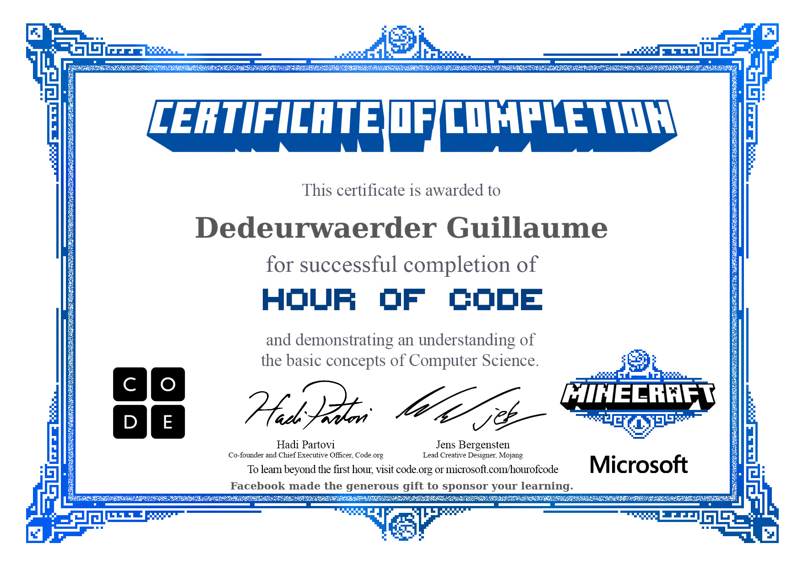
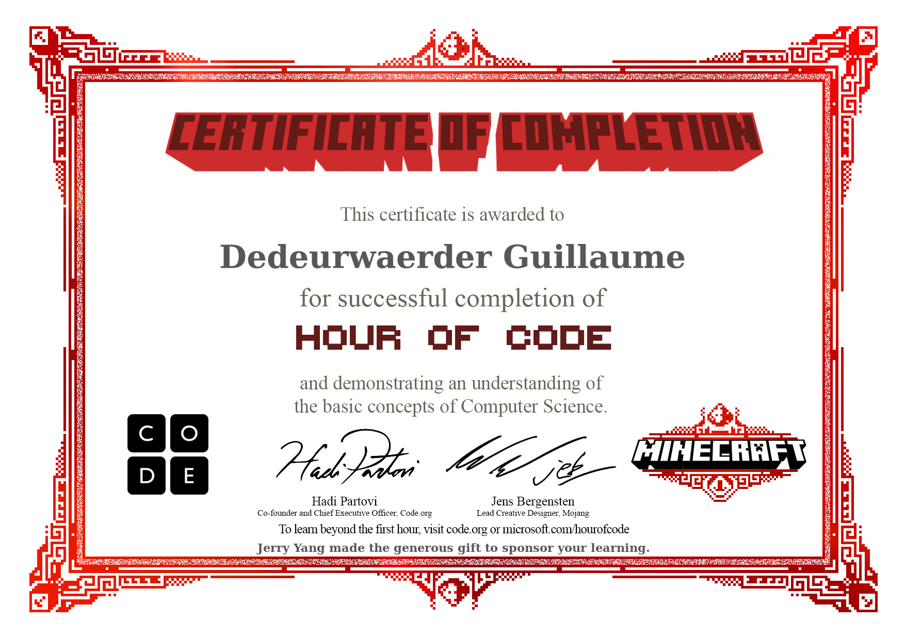
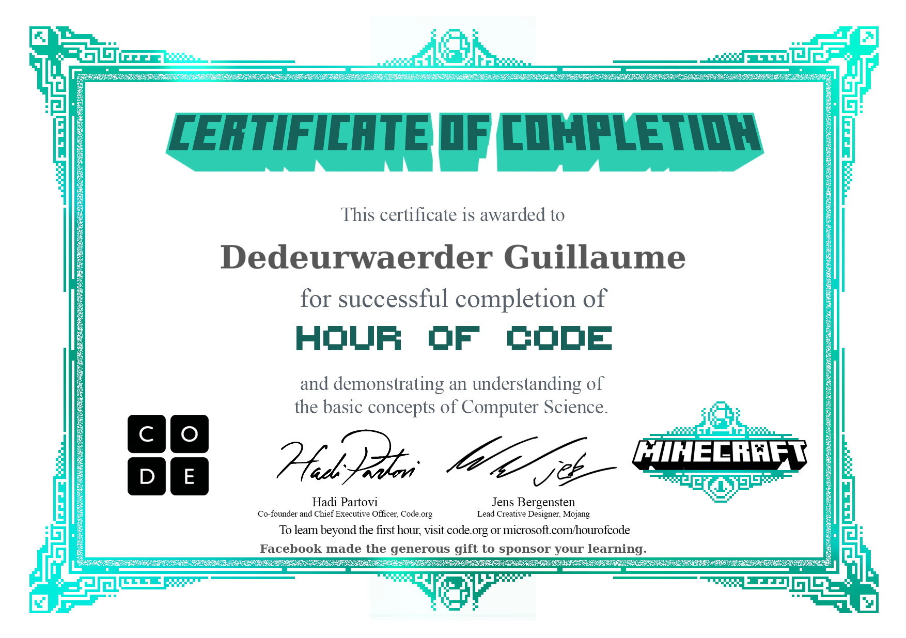
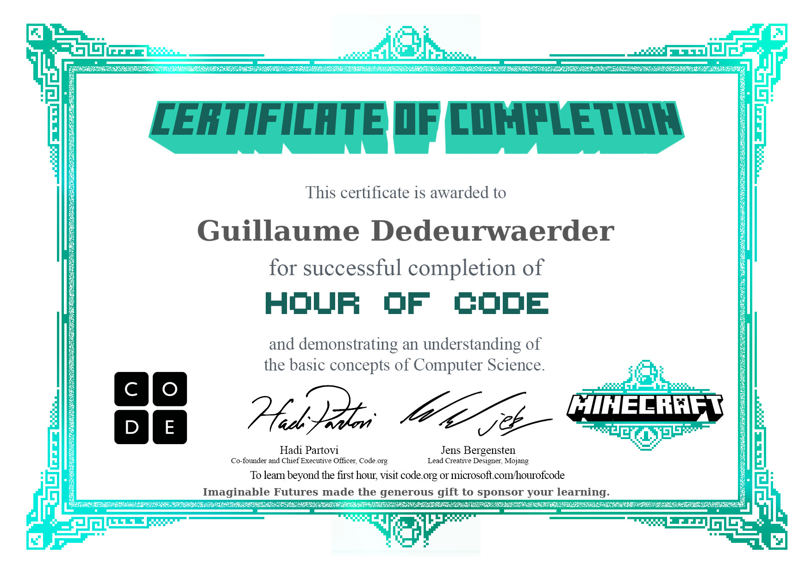
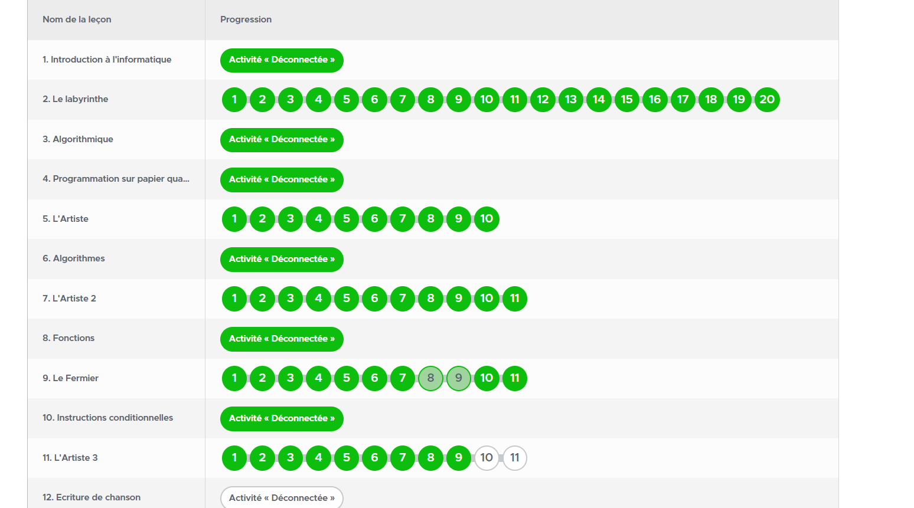

# Défis de Pensée Logique 👨‍💻

Bienvenue dans le monde des défis de pensée logique! 🧠 Ce répertoire contient des mini-jeux conçus pour renforcer vos compétences en programmation et votre logique. 🎮 Avant d'explorer les exercices de pseudocode, vous êtes encouragé à relever ces défis pour bien vous préparer. 🚀

## Objectifs d'apprentissage 📚

À la fin de ces défis, vous devriez maîtriser les concepts clés suivants :

- Logique de programmation 🤔
- Conditions 🤷‍♂️
- Boucles 🔁
- Tableaux 📦
- Fonctions 📋

## Instructions 📋

### Silent Teacher 🤐

1. Accédez au dossier "Silent Teacher".
2. Suivez les instructions pour résoudre les exercices. 📝
3. Prenez des captures d'écran de vos solutions pour montrer vos progrès. 📷

### Minecraft 🪓

1. Accédez au dossier "Minecraft".
2. Suivez les instructions pour accomplir les tâches spécifiées dans ce mini-jeu.
3. Prenez des captures d'écran de vos accomplissements pour immortaliser vos réussites. 🌟

## Résumé 📃

### Silent Teacher

Le mini-jeu "Silent Teacher" a été une excellente opportunité pour renforcer ma compréhension de la logique de programmation. J'ai travaillé sur des problèmes variés impliquant des conditions, des boucles et des fonctions. 

### Minecraft

"Minecraft" a été un défi passionnant pour mettre en pratique mes compétences en logique de programmation. J'ai accompli des tâches liées à la manipulation de tableaux et à l'écriture de fonctions. Les captures d'écran de fin sont disponibles plus bas.

### Captures d'écran 📸

🎉

---

J'ai apprécié ces défis et je suis confiant que ma compréhension de la programmation et de la logique s'est améliorée. 🙌 Prêt pour la prochaine étape de mon parcours d'apprentissage! 🚀
